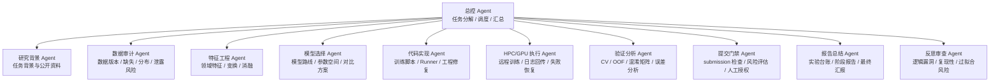
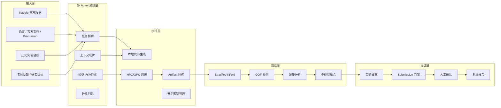
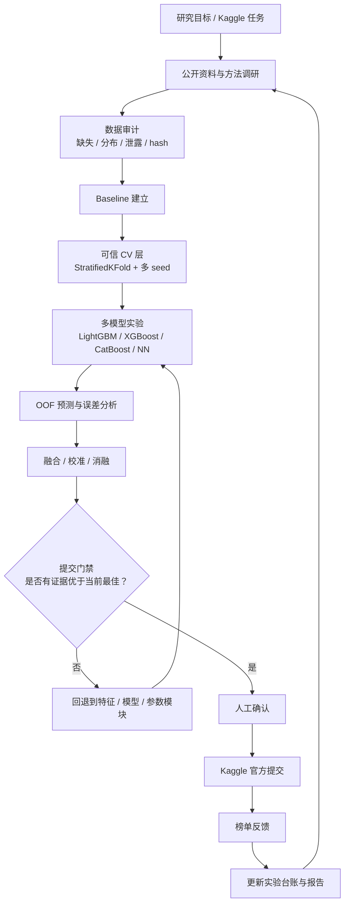

# 基于多 Agent 协同的 AI 科研工作站框架汇报

## 摘要

本项目构建的是一个面向 Kaggle/HPC 机器学习科研任务的 AI 科研工作站。它的目标不是让单个大模型端到端完成全部工作，而是通过多 Agent 协同、任务分解、上下文隔离、实验台账和质量门禁，把复杂科研任务拆成可验证、可回退、可复现的模块化流程。

本研究的核心问题是：即使当前强模型已经具备较长上下文，例如 1M token，完整科研任务仍会同时包含研究背景、文献调研、数据审计、代码实现、模型训练、交叉验证、误差分析、榜单反馈和报告撰写。单 Agent 很容易出现上下文爆表、职责混杂、历史实验遗忘和结果不可复现。因此，本工作站的核心价值在于用多 Agent 协作来缓解单模型上下文与职责容量不足的问题。

一句话概括：

> 通过多 Agent 协同和 artifact-based workflow，将超出单模型上下文能力的完整科研机器学习任务，拆解为可验证、可回退、可复现的模块化科研流程，从而提升实验稳定性、科研规范性和最终模型效果。

## 1. 研究背景与问题定义

当前大语言模型已经可以辅助代码编写、数据分析、论文总结和实验报告生成，但在真实科研机器学习任务中，单个模型仍然面临明显边界。以 Kaggle 竞赛或科研建模任务为例，一个完整流程通常包含：

- 研究背景理解与公开资料调研
- 官方数据、评价指标和 submission 格式解析
- 数据审计、特征工程与模型路线选择
- 代码实现、调试和 HPC/GPU 训练
- 交叉验证、OOF 预测、误差分析和多模型融合
- 官方提交、榜单反馈和下一轮实验决策
- 科研报告、实验日志和可复现材料整理

这些任务同时进入一个模型上下文时，会造成如下问题：

1. **上下文超载**：数据、代码、日志、论文、实验结果和报告材料同时存在，容易超过模型有效处理能力。
2. **职责混杂**：同一个 Agent 同时负责研究、工程、调参、审查和报告，容易遗漏关键环节。
3. **长期实验记忆不稳定**：多轮实验后，模型容易忘记历史假设、失败原因、当前最佳结果和提交边界。
4. **结果不可复现**：如果只有对话结论，没有实验台账、代码版本、参数记录和 artifact 路径，科研可信度不足。
5. **质量门禁缺失**：仅依赖 public leaderboard 反馈，容易过拟合榜单，不能形成可靠科研判断。

因此，本项目要解决的核心矛盾是：

```text
科研任务复杂度 > 单模型上下文窗口 + 单 Agent 职责容量
```

## 2. 核心思想：多 Agent 上下文分治

本系统采用多 Agent 协同架构，将完整科研任务拆解为多个职责清晰的子模块。每个 Agent 只处理自己负责的上下文、产物和质量标准。如果某个模块结果不达标，则退回该模块重新执行，而不是让整个系统在错误基础上继续推进。

### 2.1 多 Agent 职责划分



这种设计的关键不是简单增加 Agent 数量，而是建立清晰的职责边界：

- 每个 Agent 有明确输入、输出和失败回退条件。
- 每个 Agent 只接收完成当前任务所需的上下文。
- 每个 Agent 必须产出可检查 artifact。
- 每个阶段都有质量门禁。
- 最终由总控 Agent 汇总全局证据，形成可复现结论。

### 2.2 Artifact 驱动而不是聊天驱动

本系统不依赖“对话里说完成了”，而是要求每一步形成可追踪文件：

- 训练脚本
- Runner 脚本
- 远程日志
- metrics.json
- OOF 预测
- submission 文件
- 实验报告
- 实验台账
- 提交审查报告

这些 artifact 共同构成科研证据链。

## 3. 与 MLE-bench 的关系

老师提到的 MLE-bench 为本项目提供了重要参照。MLE-bench 是一个面向机器学习工程任务的 benchmark，它使用真实 Kaggle 竞赛评估 AI Agent 在数据处理、模型训练、代码实现和 submission 生成方面的能力。其 leaderboard 奖牌率较高，说明 Agentic AI 已经在 Kaggle 类任务中展现出较强潜力。

但本项目并不是简单复刻 MLE-bench，也不是只追求某个榜单结果。MLE-bench 更像是评价 Agent 能力的外部基准；本项目关注的是如何把这类能力工程化，形成一个可长期运行、可审计、可复现的科研工作站。

```text
MLE-bench 关注：Agent 能不能完成 Kaggle 任务
本项目关注：如何构建一个能稳定完成科研机器学习任务的多 Agent 工作站
```

本系统借鉴 MLE-bench 的方面包括：

- 使用真实 Kaggle 任务作为验证场景
- 关注完整机器学习工程流程
- 使用官方榜单结果作为外部反馈
- 重视 Agent 在数据、模型、代码和提交中的工程能力

本系统进一步强化：

- 多 Agent 分工
- 上下文隔离
- HPC/GPU 真实执行
- 本地 CV 与 OOF 证据
- 实验台账与回滚机制
- Submission 人工门禁
- 科研报告生成

## 4. 系统总体架构



## 5. 当前工作站实践证据

当前系统已经在 `playground-series-s6e6 / Predicting Stellar Class` 任务上形成了真实闭环。

### 5.1 已打通链路

- Kaggle API 下载官方数据
- Windows DPAPI 管理 Kaggle 凭据
- 本地任务配置与数据 hash 记录
- SSH/HPC 远程执行
- A800 GPU / CUDA 训练
- 训练产物回传
- Submission schema 校验
- Kaggle 官方提交与 public score 查询
- 实验台账与报告生成

### 5.2 当前实验进展

| 实验 | 方法 | 角色 | 结果状态 |
|---|---|---|---|
| EXP000 | PyTorch MLP baseline | 打通 Kaggle-HPC-GPU-submission 闭环 | 官方 public score 0.95272 |
| EXP001 | Logistic Regression | 第一个可信 repeated CV baseline | OOF balanced accuracy 0.92769 |
| EXP002 | ExtraTrees | 非线性树模型基线 | OOF balanced accuracy 0.94985 |
| EXP003 | LightGBM | 当前最佳 standalone 官方提交模型 | OOF 0.96564，public score 0.96639 |
| EXP004 | XGBoost GPU | 模型多样性候选 | OOF 0.96507 |
| EXP005 | LightGBM + XGBoost OOF blend | 当前最佳本地 CV 融合 | OOF 0.96569，未提交 |

这说明系统已经从“能跑通 baseline”进入“可实验、可验证、可迭代”的阶段。

## 6. 科研实验工作流



每轮实验必须形成闭环：

```text
实验假设 -> 代码实现 -> HPC/GPU 训练 -> CV 结果 -> 误差分析 -> 决策 -> 记录
```

如果结果不达标，则只回退对应模块，而不是整体重来。

## 7. 本项目相对已有工作的改善点

### 7.1 从单 Agent 端到端转向多 Agent 分治

单 Agent 端到端处理完整 Kaggle 任务时，上下文很容易混入过多材料。多 Agent 分治可以让每个 Agent 只看到与自己任务相关的上下文，从而降低遗忘和混乱。

### 7.2 从 prompt 输出转向 artifact-based workflow

传统对话式 Agent 容易停留在“生成建议”。本系统要求每一步都产生实际文件，并且后续 Agent 读取这些 artifact 决策，提升可复现性和审计能力。

### 7.3 从“最强模型”转向“模型-角色适配”

本系统不假设一个模型适合所有任务，而是按任务选择模型：

- 总控规划：强推理模型
- 代码实现：Codex 类模型
- 数据分析：结构化分析 Agent
- 文献与报告：长上下文写作/研究 Agent
- 质量审查：反思与审查 Agent

### 7.4 从 leaderboard 驱动转向科研验证驱动

系统不只看 public score，而是综合：

- 本地 CV
- OOF 预测
- 多 seed 稳定性
- 误差分析
- log loss
- confusion matrix
- submission 风险

这更符合科研实验标准。

### 7.5 从自动化脚本升级为科研 OS

本项目不是单个训练脚本，而是一个包含任务定义、实验执行、质量控制、报告生成和回滚机制的科研操作系统雏形。

## 8. 研究边界

为了避免过度宣称，需要明确本项目不声称：

- 发明新的基础模型
- 发明多 Agent 技术
- 发明 AutoML
- 发明 Kaggle Agent
- 保证单次实验超过所有 leaderboard 方法

更准确的表述是：

> 本研究构建并验证了一个面向 Kaggle/HPC 机器学习任务的多 Agent 科研工作站框架，用任务分解、上下文隔离、角色化 Agent、实验台账和质量门禁，缓解单一大模型在长流程科研任务中的上下文不足、职责过载和结果不可复现问题。

## 9. 后续研究计划

在下一阶段，我会围绕“可长期运行、可复现、可审查”的科研工作站目标继续推进，而不是只追求单次 Kaggle 提交分数。具体计划如下。

### 9.1 完善 Agent 协作协议

我会进一步明确每个 Agent 的输入、输出、质量标准和失败回退条件，使任务拆解不只是口头分工，而是可以被系统执行和检查的协作协议。

### 9.2 建立任务调度器

我计划根据任务类型自动选择合适的 Agent 和模型。例如，总控规划使用强推理模型，代码实现使用 Codex 类模型，数据审计和误差分析使用结构化分析 Agent，从而实现模型能力与任务角色的匹配。

### 9.3 强化实验记忆系统

我会让系统自动读取历史实验台账、失败原因、最佳参数和当前最优结果，避免重复执行已经证明无效的实验路线，并保证长期迭代过程中的实验记忆稳定。

### 9.4 扩展模型路线

在当前 LightGBM/XGBoost 基础上，我会继续加入 CatBoost、Optuna、概率校准、多 seed ensemble 和 stacking，并通过本地 CV、OOF 和误差分析决定是否进入提交门禁。

### 9.5 对齐 MLE-bench 思路做多任务验证

我不会只在一个 Kaggle 任务上验证系统有效性，而是逐步扩展到多个 Kaggle 或科研建模任务，检验多 Agent 工作站是否具备跨任务的稳定性和可迁移性。

### 9.6 建立工作站综合评价指标

除了 public score，我会进一步评估可复现性、实验完整性、自动化程度、人工审核成本和报告质量，使系统评价更接近真实科研标准。

## 10. 汇报总结

本次汇报中，我想强调的是：我搭建的不是单纯的 Kaggle 自动训练脚本，而是一个面向机器学习科研任务的多 Agent AI 科研工作站。

我的核心问题意识是：即使最强模型已经有 1M 上下文，也很难在一个连续上下文中同时稳定承担文献调研、数据审计、代码实现、模型训练、误差分析、提交决策和报告总结这些完整科研流程。因此，我把完整任务拆成多个可验证模块，让不同 Agent 分别负责研究、数据审计、模型选择、代码实现、HPC 训练、CV/OOF 误差分析、提交门禁和报告总结。

这种设计的意义在于，它用多 Agent 协作和 artifact-based workflow 缓解单模型上下文不足、职责过载和实验不可复现的问题。每个阶段都需要形成可检查的代码、日志、指标、submission、实验台账或报告，结果不达标时只回滚对应模块，而不是让整个系统在错误基础上继续推进。

MLE-bench 说明 Agent 在 Kaggle 类机器学习工程任务中已经具备较高潜力，而我的工作重点是把这种能力工程化为一个可长期运行、可审查、可复现的科研工作站。这也是本项目相对于单 Agent 自动化脚本或单次榜单优化的主要区别。

## 参考资料

- MLE-bench official website: https://www.mlebench.com/
- MLE-bench paper: https://arxiv.org/abs/2410.07095
- Project experiment log: `experiments/EXPERIMENT_LOG.md`
- Project CV analysis: `reports/CV_AND_ERROR_ANALYSIS.md`
- Project Kaggle/HPC evidence: `docs/Kaggle-HPC-GPU闭环验证-20260614.md`
