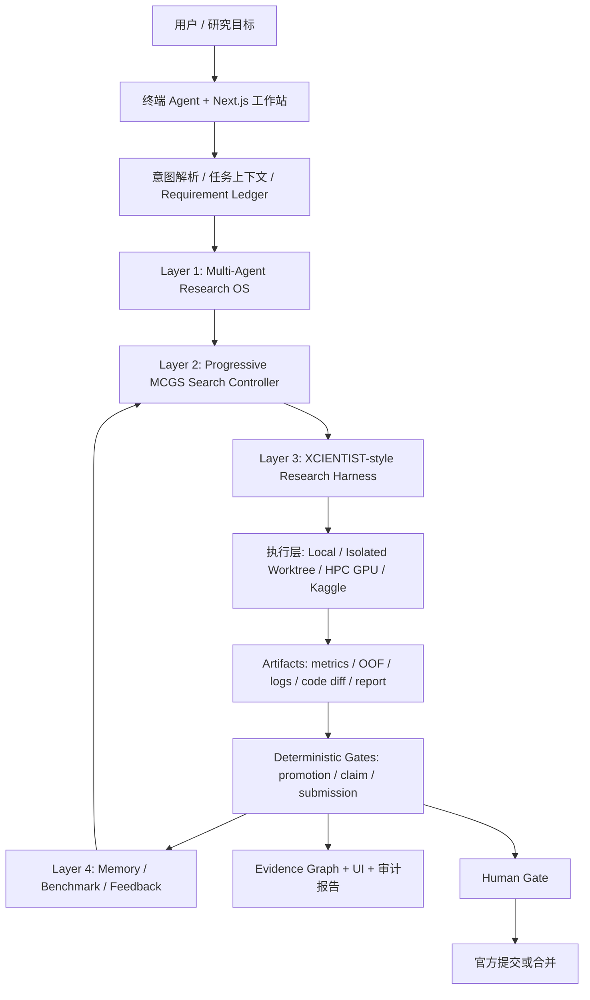

# EvoMind 系统架构与能力展示汇报

> 审计日期：2026-07-23  
> 审计对象：`D:\桌面\codex\科研港科技` 当前工作树  
> 结论口径：以当前源码、磁盘 artifact、自动化测试和既有真实运行验收为准；规划文档只作背景，不作为能力证明。

## 1. 执行摘要

EvoMind 已经形成一个面向机器学习研究任务的 **可审计、可恢复、带确定性门禁的 Agentic Research OS**。它不是一个单纯的聊天前端，也不是单次训练脚本，而是把自然语言科研目标转化为任务上下文、实验搜索、受控执行、证据登记、独立审查、记忆沉淀和报告输出的完整工作站。

当前最准确的判断是：

- **工程闭环：已证明。** 当前有 Research OS、渐进式图搜索、科研验证框架、长期记忆、隔离代码工作树、Web 工作站和 HPC/Kaggle 适配层。
- **关键机制：已证明。** best-so-far 保护、失败不晋升、UCT/MCGS 选点、多分支探索、验证契约、claim audit、事件追踪和 Human Gate 均有代码、测试或真实 artifact 支撑。
- **有界 Agent 能力：已证明。** 发布版本曾通过 12/12 hidden-oracle 工作区任务；2026-07-21 真实工作站闭环通过 41/41 验收。
- **普适科研增益：尚未充分证明。** 还缺统一预算、统一数据切分下的跨任务多轮对照实验，不能把局部成功直接外推为普遍自进化能力。
- **MLE-Bench 75 / 超越 MLEvolve：尚未证明。** 当前不能用部分任务、CV/proxy 或历史局部结果作同条件强对比。

一句话定位：

> EvoMind 的核心创新不是“让大模型写训练代码”，而是把科研 Agent 放进一个由搜索图、证据契约、确定性门禁、长期记忆和人工审批共同约束的可运行系统。

## 2. 当前系统架构

### 2.1 逻辑架构



### 2.2 四层职责与代码落点

| 层 | 核心职责 | 当前主要实现 |
|---|---|---|
| Layer 1 Multi-Agent Research OS | 任务拆解、工具调用、状态机、Agent 交接、artifact 注册、事件流 | `src/research_os/agent/`、`src/research_agent_workstation/server/agents/`、`server/services/agent_orchestrator.py` |
| Layer 2 Search Controller | 多分支实验图、UCT 选点、探索/利用切换、Base/Stepwise/Diff、best-so-far | `evolution_loop.py`、`mcgs_selector.py`、`search_graph.py`、`variation_generator.py` |
| Layer 3 Research Harness | 假设、实现契约、验收指标、消融、风险、证据和结论边界 | `validation_contract.py`、`claim_audit.py`、`server/research_harness/` |
| Layer 4 Memory/Benchmark/Feedback | 成败经验持久化、跨轮检索、基准管理、官方结果边界 | `retrospective_memory.py`、`memory_vector_index.py`、`benchmark_manager.py` |

横向基础设施包括：

- **交互层**：`src/xsci/` 终端 Agent；`web/research-agent-workstation/` Next.js 工作站。
- **适配层**：LLM、Code Agent、Python Runner、HPC/GPU、Kaggle 和存储适配器。
- **治理层**：Gate Engine、Evidence Graph、Artifact Registry、Tool Ledger、Recovery Guard、Human Gate。
- **工程隔离**：生成式代码修改在 detached Git worktree 中执行，验收命令白名单化，主工作树保持不变，最终合并由人确认。

### 2.3 一次科研任务的实际闭环

1. 用户以自然语言提出目标，系统解析任务、约束和证据需求。
2. Scientist 读取任务、数据、历史实验、资源状态和已有 artifacts。
3. MCGS Controller 选择要扩展的搜索节点、分支类型和代码生成模式。
4. Agent 形成可证伪假设，生成或修改实验代码并受控执行。
5. Runner 返回真实成功状态、指标、日志和输出文件。
6. Promotion Gate 根据运行成功、指标方向、最小增益和所需 artifacts 决定晋升或保留父节点。
7. Validation Contract 和 Claim Audit 限制结论强度，失败运行即使留下分数也不得晋升。
8. 结果写入 Search Graph、Retrospective Memory、事件流和研究报告，供下一轮检索。
9. 官方 Kaggle 提交或代码合并继续停在 Human Gate 后。

这是一种 **LLM 负责提出候选、确定性程序负责执行与裁决、artifact 负责证明** 的混合架构。

## 3. 采用的论文与系统思想

下表区分“思想借鉴”和“逐字复现”。EvoMind 是工程融合，不应表述为对某篇论文的完整复现。

| 来源 | 借鉴思想 | EvoMind 中的落点 | 当前成熟度 |
|---|---|---|---|
| MLE-Bench, arXiv:2410.07095 | 用真实 Kaggle 任务和最终产物评估 ML Agent；不信任自报成功 | hidden-oracle benchmark、任务注册表、官方结果与 proxy 分离 | 基准框架已实现；75 任务完整同条件结果缺失 |
| MLEvolve, arXiv:2606.06473 | Progressive MCGS、UCT、分阶段探索/利用、跨分支聚合、Retrospective Memory | `mcgs_selector.py`、`evolution_loop.py`、`search_graph.py`、`retrospective_memory.py` | 核心机制已实现并有测试/真实运行证据 |
| XCIENTIST, arXiv:2606.18874 | 文献落地、假设契约、实验记录、claim boundary 和独立审查 | `server/research_harness/`、`validation_contract.py`、`claim_audit.py` | 契约与审计已落地；完整科研发现质量仍需跨任务评估 |
| AutoKaggle, arXiv:2410.20424 | 多 Agent 协作覆盖数据、建模、调试、测试和人工干预 | AgentOrchestrator、角色化 Agent、阶段工作流、Human Gate | 工程闭环已落地 |
| Agent K, arXiv:2411.03562 | Kolb 式“经验-反思-抽象-再实验”循环和跨任务经验迁移 | Reflection Agent、Retrospective Memory、lesson 检索和失败归因 | 记忆读写已落地；因果增益需要对照实验 |
| AutoResearch AI, arXiv:2605.23204 | 从 grounding、planning 到 experimentation、validation、reporting 的端到端科研自动化；强调 provenance | Scientist 工具链、Evidence Graph、Artifact Registry、Research Report | 流程与 provenance 已落地 |
| AutoSOTA, arXiv:2604.05550 | 论文理解、代码、环境、实验、指标验证、反思与改进串成闭环 | Literature、Code Agent、HPC Runner、Validation/Reflection | 部分落地；通用论文复现仍属扩展方向 |
| ReAct 类 Agent 范式 | Reasoning 与 Action 交替，根据 observation 动态选择下一工具 | `scientist_adaptive_loop.py` 的 observe/act/replan 工具循环 | 已实现有界自适应循环 |
| 软件工程 Agent / 隔离执行思想 | 模型只提出结构化动作，宿主程序控制文件系统、命令、范围和验收 | `workspace_agent.py` detached worktree、allowlist、final diff、main-worktree invariant | 12/12 行为基准已证明有界能力 |
| MCTS/UCT 经典思想 | 用 exploitation reward 与 exploration bonus 平衡已知好节点和未探索节点 | `MCGSSelector._uct()`、祖先链 backpropagation、stagnation 分支策略 | 已修复 visit count 失效问题并测试 |

### 3.1 真正值得强调的融合点

EvoMind 不是把多个论文名放进界面，而是把它们组合成三组互相制约的机制：

1. **搜索与验证分离**：MLEvolve-style Controller 决定“试什么”，XCIENTIST-style Harness 决定“这个结果能否成立”。
2. **生成与裁决分离**：LLM 生成假设和候选代码，确定性 Gate 根据真实运行状态、指标和 artifacts 裁决。
3. **经验与证据分离**：Memory 可以影响下一轮，但只有经过验证的结果才能升级为 validated lesson；失败和 provisional 经验分别保留。

这三点比“用了多 Agent”更能说明系统架构价值。

## 4. 当前能力证据

### 4.1 2026-07-23 当前静态与测试证据

- Python 源模块：154 个。
- Web TypeScript/TSX 源文件：147 个。
- Python 测试文件：62 个。
- 搜索图 `search_graph.json`：55 份。
- 验证契约 `validation_contract.json`：326 份。
- 声明审计 `claim_audit.json`：322 份。
- `experiments/`、`workspace/`、`.xsci/` 下 JSONL 文件：1008 份。
- `scripts/run_ci_checks.py`：4/4 gates 通过。
- 测试结果：763 tests collected，全部通过。
- 154 个一方 Python 模块全部可导入，源码编译和明文 secret 扫描通过。

### 4.2 真实运行证据

2026-07-21 的正式闭环验收记录证明：

- 全量验收 41/41 通过。
- 当前运行 DAG 有 14 个节点、19 条边、15 次 handoff。
- 事件流有 78 条连续事件，并验证增量读取契约。
- Reviewer 与 Claim Audit 均通过。
- A40 HPC 五折 telemetry 存在，本地 GPU 未被使用。
- 桌面和移动端真实浏览器验收通过，控制台错误/警告为 0。
- 官方 Kaggle score 不存在，系统正确保持 Human Gate。

发布版本的 workspace agent 还通过了 12/12 hidden-oracle 行为测试，覆盖检索、跨文件修改、失败恢复、约束遵循、语义验证、候选 diff 生成和主工作树完整性。

### 4.3 能力分级

| 能力 | 当前等级 | 证明材料 | 还缺什么 |
|---|---|---|---|
| 自然语言到科研计划 | 已证明 | Scientist turn plan、requirement ledger、tool trace | 更广任务集的人评质量 |
| 动态工具选择与失败后重规划 | 已证明 | adaptive loop、今天更新的 step/turn JSONL | 多模型、多故障类型统计 |
| 多分支实验搜索 | 已证明 | 55 份 search graph、MCGS 测试、GPU 分支运行 | 同预算跨任务消融 |
| best-so-far 与失败保护 | 已证明 | deterministic promotion gate、测试和 claim audit | 无关键架构缺口 |
| 长期记忆读写 | 已证明 | retrospective memory、lesson 注入代码和 tests | 记忆带来净增益的因果对照 |
| 科研结论审计 | 已证明 | 326 contracts、322 audits、Reviewer | 更复杂统计结论的人类复核 |
| 隔离代码工程 Agent | 已证明（有界） | 12/12 hidden-oracle suite、worktree invariant | 更大真实仓库和长任务 benchmark |
| HPC/GPU 编排 | 已证明（指定环境） | A40 telemetry、job artifacts、资源 gate | 多集群可移植性和故障演练 |
| Web 可视化工作站 | 已证明（最近验收） | 41/41、桌面/移动截图和浏览器日志 | 当前进程未运行，演示前需重新启动 |
| 跨任务普适自进化 | 部分证明 | 多任务 artifacts、局部性能改进 | 统一 split/budget 的 A/B 与统计显著性 |
| MLE-Bench 75 对标 | 未证明 | 只有模板和部分任务结果 | 75 任务完整、同规则、同预算结果 |
| 稳定奖牌率或超越 MLEvolve | 未证明 | 无足够官方同条件证据 | 官方提交 artifact 和可比 benchmark |

## 5. 架构优势与主要风险

### 5.1 优势

- **可审计**：每次实验都有节点、父子关系、指标、运行状态、artifact 和结论边界。
- **可恢复**：事件流、session、recovery guard、context packet 和 continuation 状态支持长任务续跑。
- **可约束**：模型不直接拥有无限制执行权，运行、晋升、提交和合并分别受程序门禁控制。
- **可替换**：LLM、Code Agent、GPU、Kaggle、存储通过 adapter 隔离，前端不需要理解具体 provider。
- **可研究**：搜索、记忆、验证和 benchmark 是独立模块，适合做消融和论文实验。
- **诚实边界强**：CV/proxy、官方分数、排名和奖牌的语义被强制分开。

### 5.2 风险与技术债

1. **实现存在双轨**：`research_os` 与 `research_agent_workstation/server/strategy` 都有 MLEvolve/Memory 相关实现，长期可能产生语义漂移。
2. **AgentOrchestrator 体积过大**：单文件约 1386 行，承担编排、执行、治理 artifact 和追踪等多类职责，后续维护风险较高。
3. **Workspace Agent 体积过大**：单文件约 1452 行；能力强，但需要进一步拆分 planner、sandbox、executor、auditor。
4. **artifact 数量大于摘要能力**：已有大量 JSON/JSONL，但缺少稳定的 run manifest 索引、版本化 schema 迁移和统一 provenance 查询。
5. **论文对齐声明需要版本管理**：部分论文为 2026 年新文献，代码注释里的章节和 arXiv 版本应锁定并定期复核。
6. **当前工作树很脏**：大量已修改与未跟踪文件使“当前源码”和“v0.2.0 发布版本”不完全等价；正式演示必须冻结 commit 或生成 immutable evidence bundle。
7. **当前 Web 服务未监听 8088**：7 月 21 日验收有效，但今天的实时演示状态不是“已启动”。演示前必须重新执行 launch gate。

## 6. 以后如何展示系统能力

展示原则不是“页面越多越好”，而是让观众看到一个任务从目标到证据的闭环，并明确哪些环节由模型决定、哪些由确定性系统控制。

### 6.1 10 分钟标准演示脚本

**第 0-1 分钟：一句话定位**

展示 Control 页面，只讲：这是一个可审计科研 Agent 工作站，核心对象是 Task、Experiment Node、Evidence、Gate 和 Memory。

**第 1-3 分钟：提出真实问题**

在终端执行一个只读 Scientist 问题，例如：

```powershell
evomind ask "检查当前任务、最近实验、证据缺口，并给出下一项可证伪实验及停止条件"
```

展示 requirement ledger、工具选择、证据引用、未知项和下一步，而不是只展示自然语言答案。

**第 3-6 分钟：展示搜索与实验**

选择一个小型、可在限定时间完成的固定数据集：

- 固定 train/validation split、seed、时间预算和基线。
- 展示 MCGS 选择的父节点、expansion type 和 Base/Stepwise/Diff 模式。
- 运行 2-3 轮，展示 candidate 指标、失败分支、promotion decision 和 best-so-far 不变量。

**第 6-8 分钟：展示科研可信性**

打开该 run 的：

- `search_graph.json`
- `validation_contract.json`
- `claim_audit.json`
- `artifact_manifest.json`
- `research_report.md`

刻意展示一个未晋升或失败节点，证明系统会拒绝好看的错误分数。

**第 8-9 分钟：展示记忆和恢复**

中断任务后恢复，展示 context packet、continuation state、事件增量读取，以及上一轮 lesson 如何进入下一轮 proposal。

**第 9-10 分钟：展示边界**

打开 Gate 页面，说明当前结果只是本地 CV/proxy；官方提交、奖牌声明和代码合并仍需 Human Gate。最后给出本次 run 的 evidence bundle 路径和 hash。

### 6.2 三套展示套餐

| 场景 | 重点 | 必备 artifact | 时间 |
|---|---|---|---|
| 老师/答辩 | 架构创新、科研可信性、论文对应关系 | 架构图、单次闭环、消融表、claim audit | 10-15 分钟 |
| 工程评审 | 隔离执行、接口契约、恢复、测试 | commit、CI log、hidden-oracle report、worktree invariant | 20-30 分钟 |
| 科研评测 | 同预算性能增益、跨任务泛化、统计显著性 | benchmark manifest、seeds、splits、metrics、官方结果 | 30 分钟以上 |

### 6.3 每次演示前的固定 Gate

```powershell
python scripts/run_ci_checks.py
python scripts/verify_workstation_launch_readiness.py --write-report
python scripts/verify_new_user_release_readiness.py --write-report
powershell -NoProfile -ExecutionPolicy Bypass -File scripts/start_verified_workstation.ps1 restart
```

然后记录：

- 当前 commit、dirty status 和配置摘要；
- Web build ID、PID、URL 和启动时间；
- 数据集 hash、split、seed、预算和 metric；
- run id 与所有 artifact 路径；
- CI/浏览器 smoke 结果；
- 是否存在官方提交与 Human Gate 审批。

### 6.4 建议建立“能力证据包”标准

每次对外展示只交付一个不可变目录：

```text
capability-demo/<demo_id>/
  manifest.json
  environment.json
  task_contract.json
  search_graph.json
  event_stream.jsonl
  validation_contract.json
  claim_audit.json
  artifact_manifest.json
  benchmark_result.json
  research_report.md
  browser_acceptance.json
  screenshots/
  checksums.sha256
```

`manifest.json` 必须包含 commit、dirty 状态、数据 hash、模型/provider、预算、seed、开始/结束时间和 Gate 状态。这样观众看到的不是一次表演，而是一份可复核实验。

## 7. 下一阶段评测设计

要把“有闭环”升级为“能力强”，建议按以下顺序推进：

### P0：冻结可复现基线

- 选 5 个任务：表格分类、表格回归、时间序列、图像、文本各 1 个。
- 固定数据、切分、seed、预算和模型调用成本。
- 每个任务运行 5 个 seed，保存完整 evidence bundle。

### P1：做四组关键消融

| 对照 | 要回答的问题 |
|---|---|
| 线性循环 vs MCGS | 图搜索是否比顺序试验产生更高 best score 或更快收敛？ |
| 无 Memory vs 有 Memory | 历史经验是否提高成功率、减少重复失败或降低成本？ |
| 无 Harness vs 有 Harness | 验证契约是否降低泄漏、错误晋升和过度结论？ |
| 单 Agent vs 多 Agent Reviewer | 独立审查是否提高问题发现率和最终 artifact 完整度？ |

### P2：统一能力指标

至少报告：

- Task success rate；
- best metric delta over baseline；
- time/cost to first valid solution；
- invalid promotion rate；
- unsupported claim rate；
- reproducibility pass rate；
- recovery success rate；
- scope violation rate；
- human intervention count；
- official score/medal rate（仅在真实官方 artifact 存在时）。

### P3：再做 MLE-Bench 75 对标

只有任务集合、预算、规则、官方结果和失败记录齐全后，才进行与外部系统的强对比。对外表述应优先使用“在同一评测协议下的结果”，而不是“看起来达到某论文水平”。

## 8. 最终汇报话术

推荐版本：

> 我们构建的 EvoMind 是一个面向机器学习科研任务的可审计 Agentic Research OS。系统采用四层架构：底层负责多 Agent 编排和 artifact 流程，中层使用 MLEvolve-style Progressive MCGS 做多分支实验搜索，上层使用 XCIENTIST-style contract 和 claim audit 约束科研结论，最外层通过 retrospective memory 和 benchmark feedback 形成长期演化。当前已经证明完整工程闭环、确定性门禁、有界代码 Agent、HPC 执行和真实浏览器工作站；下一阶段重点不是继续堆功能，而是在统一预算下用多任务消融证明搜索、记忆和审查机制带来的可重复净增益。

不推荐版本：

- “系统已经达到或超过 MLEvolve。”
- “已经完成 MLE-Bench 75。”
- “能够全自动获得 Kaggle 奖牌。”
- “页面显示训练成功，所以科研能力已被证明。”
- “有 memory 文件，所以自进化已经被因果证明。”

## 9. 本次审计结论

**架构完整度：GO。** 四层逻辑架构及其横向治理、适配和交互层均有真实实现。

**工程展示准备度：CONDITIONAL GO。** 2026-07-21 已有完整验收证据，但当前 Web 服务未监听且工作树未冻结；按第 6.3 节重新启动、执行 Gate 并生成当次 evidence bundle 后即可正式展示。

**普适科研能力强结论：NO-GO。** 现有证据足以证明系统会运行、会搜索、会审计、会恢复，但不足以证明在统一预算下稳定提高跨任务科研表现。

**MLE-Bench 75 / 超越外部系统声明：NO-GO。** 等待完整同条件 benchmark 和官方结果。

## 10. 主要证据入口

- `README.md`
- `src/research_os/evolution_loop.py`
- `src/research_os/mcgs_selector.py`
- `src/research_os/search_graph.py`
- `src/research_os/retrospective_memory.py`
- `src/research_os/validation_contract.py`
- `src/research_os/claim_audit.py`
- `src/research_os/agent/session.py`
- `src/xsci/scientist_adaptive_loop.py`
- `src/xsci/workspace_agent.py`
- `src/xsci/agentic_capability_benchmark.py`
- `src/research_agent_workstation/server/research_harness/`
- `src/research_agent_workstation/server/services/agent_orchestrator.py`
- `docs/evomind_aibuildai2_final_closeout_20260721.md`
- `.xsci/agentic_capability_benchmark.json`
- `.xsci/scientist_latest_turn.json`
- `configs/research_sources.yaml`

