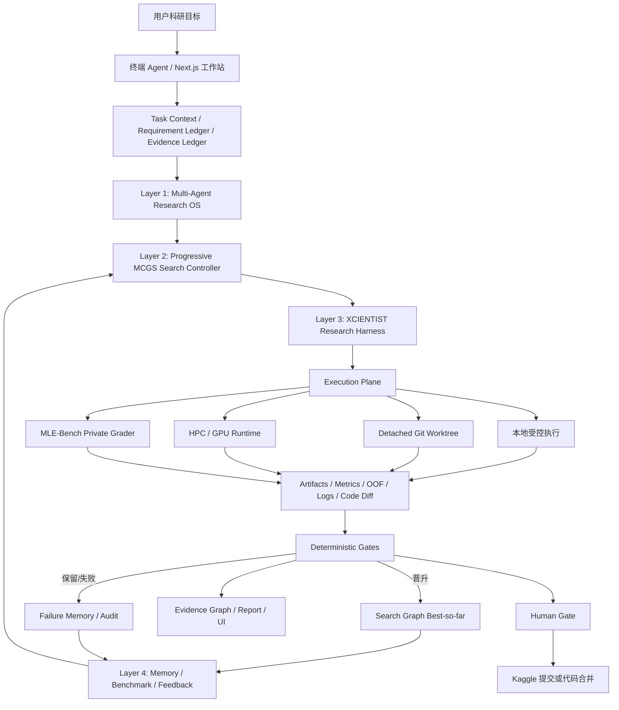

# EvoMind MLE 系统完整思想架构、能力框架与阶段研究成果

> **文档日期**：2026-07-27（Asia/Shanghai）  
> **审计对象**：`D:\桌面\codex\科研港科技` 当前工作树  
> **事实口径**：当前源码、当前磁盘 artifact、MLE-Bench 离线 grader 结果、实时训练账本与本次 CI；历史文档只用于解释演进过程。  
> **系统名称**：EvoMind / XCIENTIST AI Research Workstation / Self-Evolving and Auditable MLE Research OS

---

## 1. 执行摘要

EvoMind 当前已经不是单一 Kaggle 训练脚本，而是一套面向机器学习研究任务的 **可审计、自进化、可恢复、受门禁约束的 Agentic Research OS**。系统将自然语言科研目标转化为任务上下文、实验搜索图、受控代码执行、指标与 artifact、独立验证、经验记忆、候选提交包和研究报告。

它的基本工作原则是：

> **LLM 负责提出假设、候选方案和代码；确定性程序负责执行、验证、晋升与阻断；artifact 负责证明；Human Gate 负责最终提交或合并。**

截至当前快照，最准确的系统结论如下。

| 维度 | 当前结论 | 证据边界 |
|---|---|---|
| 四层思想架构 | **已落地** | Research OS、MCGS、Validation Contract、Claim Audit、Memory、Benchmark 均有源码与 artifact |
| 端到端工程闭环 | **已证明** | 任务→实验→运行→Gate→证据→报告→恢复链路存在 |
| 多模态 MLE 适配 | **已落地并实跑** | 表格、文本、图像、图像复原、多标签、多目标、文本规范化等 Lite 任务已有执行结果 |
| Progressive MCGS 搜索 | **机制已在真实 GPU 验证** | 多分支、diversify、cross-branch、aggregation、best-so-far 与失败保护已有真实运行证据 |
| MLE-Bench Lite 22 当前成绩 | **21/22 已评分，13 枚牌，6 金** | 单 seed 的确定性 MLE-Bench private grader 快照 |
| Lite 全量奖牌率 | **59.09%** | 13/22；已评分子集为 61.90% |
| Lite 榜首目标 | **尚未达到** | 榜首 80.30%；至少需 18/22，当前差 5 枚牌 |
| 75 任务完整对标 | **尚未完成** | 当前重点已转向 Lite 22；不能把部分任务等同 75 任务结果 |
| Kaggle 官方线上提交 | **本轮未执行** | 候选包与 Human Gate 存在，但离线 grader 不是 Kaggle 在线提交 |
| 当前代码健康度 | **CONDITIONAL / NO-GO for clean release** | 本次 CI 3/4 Gate 通过；1349 项测试中 8 项失败 |

一句话定位：

> EvoMind 的核心价值不是“自动写一个高分模型”，而是把机器学习研究变成一个可搜索、可证伪、可审计、可恢复、可持续积累经验的工程系统。

---

## 2. 系统的核心思想

### 2.1 从“自动训练器”升级为“科研操作系统”

传统 AutoML 通常围绕固定搜索空间做超参数优化；普通代码 Agent 通常围绕一次需求生成代码。EvoMind 的设计对象更大：它管理的是一个长期科研过程，包括目标、假设、分支实验、代码变化、运行状态、失败原因、证据、结论边界和后续记忆。

因此系统的基本对象不是“模型文件”，而是：

- `Task`：研究目标、约束、数据、指标、预算和停止条件；
- `ExperimentNode`：一个可追踪实验及其父节点、假设、实现、指标与状态；
- `Artifact`：代码、日志、OOF、submission、模型、环境、报告和 hash；
- `Gate`：对运行成功、指标改善、schema、证据完整性和提交权限做确定性裁决；
- `Evidence`：支撑 claim 的可复核材料；
- `MemoryRecord`：通过验证的经验、失败模式与待验证经验；
- `HumanGate`：官方提交、代码合并和强结论的最终人工边界。

### 2.2 五个基本分离原则

#### 1. 生成与裁决分离

LLM 可以提出高风险或高收益候选，但不能自行宣告成功。真正的成功由运行退出码、指标、schema、artifact 和 Gate 决定。

#### 2. 搜索与验证分离

- MLEvolve-style Search Controller 决定“下一步试什么”；
- XCIENTIST-style Research Harness 决定“这个实验是否足以支持结论”。

这样避免“只看分数的盲目提分”和“只写报告不做搜索”两种极端。

#### 3. 经验与证据分离

历史经验可以影响下一轮 proposal，但只有通过验证的结果才能成为 validated lesson。失败、观察事实、临时推测和稳定结论分别存储，避免记忆污染。

#### 4. 本地代理指标与官方结果分离

系统严格区分：

- `cv_score`：本地 OOF/holdout；
- `proxy_score`：内部统一比较值；
- `mle_private_grader_score`：MLE-Bench prepared/private 离线评分；
- `kaggle_public/private_score`：真实 Kaggle 提交返回；
- `medal/rank`：只有相同规则和对应评分证据存在时才使用。

#### 5. 自动执行与最终控制分离

训练、评分、验证和候选包生成可以自动化；Kaggle 正式提交、主工作树合并和强对外声明继续停在 Human Gate 后。

### 2.3 失败优先的工程哲学

系统不会把“进程死亡前写出的漂亮 metrics.json”当作成功。2026-07-02 的关键修复将 `run_success` 设为晋升硬前置条件：非零退出、OOM、超时或崩溃一律不得晋升，即使分数文件已经落盘。

同时，失败信息经过清洗后写入 `run_error.txt`，真实 traceback 会进入 Diff 修复 prompt，下载进度条等噪声不会污染记忆与下一轮推理。

---

## 3. 完整思想架构

### 3.1 总体架构图



### 3.2 四层核心架构

| 层 | 解决的问题 | 核心机制 | 当前代码落点 |
|---|---|---|---|
| Layer 1：Multi-Agent Research OS | 谁做、怎么协作、如何留下上下文与 artifact | 任务分解、Agent 编排、消息、会话、工具、ledger、报告 | `src/research_os/agent/`、`src/xsci/`、工作站 server |
| Layer 2：Search Controller | 下一步试什么、如何平衡探索与利用 | Search Graph、UCT/MCGS、Base/Stepwise/Diff、diversify、cross-branch、aggregation | `evolution_loop.py`、`mcgs_selector.py`、`search_graph.py`、`variation_generator.py` |
| Layer 3：Research Harness | 结果能否成立、结论能说到哪 | Hypothesis、Validation Contract、Acceptance Criteria、Ablation、Risk Check、Claim Audit | `validation_contract.py`、`claim_audit.py`、research harness |
| Layer 4：Memory / Benchmark / Feedback | 如何积累经验并做长期评测 | Retrospective Memory、向量索引、Benchmark Manager、官方结果边界 | `retrospective_memory.py`、`memory_vector_index.py`、`benchmark_manager.py` |

### 3.3 横向六个平面

1. **交互平面**：`evomind` 终端、自然语言 Scientist、Next.js 工作站。
2. **执行平面**：本地 Python、隔离 worktree、HPC/GPU、MLE-Bench grader。
3. **模型平面**：LLM provider/model router、结构化 tool calling、代码 Agent。
4. **证据平面**：Artifact Registry、Evidence Graph、Tool Ledger、JSON/JSONL 事件流。
5. **治理平面**：Promotion Gate、Submission Gate、Claim Audit、Human Gate。
6. **恢复平面**：session、context rescue、recovery guard、persistent queue、heartbeat、frozen plan hash。

---

## 4. 一次 MLE 任务的完整闭环

```text
自然语言目标
  → 任务解析与约束台账
  → 数据/资源/历史证据审计
  → 任务画像与模态识别
  → 模型族/策略推荐
  → MCGS 选择父节点与 expansion 类型
  → 形成可证伪假设和 Validation Contract
  → Base / Stepwise / Diff 生成候选代码
  → 本地隔离或 HPC/GPU 执行
  → CV/OOF/日志/submission/artifact 落盘
  → 运行成功硬门禁
  → 指标方向、min_delta、schema、证据完整性裁决
  → 晋升 best-so-far 或记录失败
  → Claim Audit 限制报告结论
  → Retrospective Memory 沉淀经验
  → 下一轮搜索
  → 候选包
  → Human Gate
  → 官方提交或人工合并
```

### 4.1 Progressive MCGS 的搜索行为

系统不是线性地“试一个模型再试一个模型”，而是维护实验图并使用方向正确的 UCT 做选点。当前支持四类 expansion：

- `primary`：建立新基线或主分支；
- `intra_branch`：围绕当前分支做局部改进；
- `cross_branch`：将其他高质量分支的机制迁移到当前分支；
- `aggregation`：融合多个顶部节点的特征、模型或后处理策略。

为解决单分支自举死锁，系统在分支停滞时允许 `DIVERSIFY`：从全局最佳节点另开新分支。全局停滞在 MCGS 模式下不再直接终止，而被视为跨分支和融合的触发信号。

### 4.2 Base / Stepwise / Diff 三种生成模式

- **Base**：从任务 spec 建立完整可复现基线；
- **Stepwise**：按明确计划扩展特征、模型或验证逻辑；
- **Diff**：在稳定父节点上做最小修复或小范围改进，尤其用于失败恢复。

### 4.3 Best-so-far 保护

候选只有同时满足以下条件才晋升：

1. 进程真实成功退出；
2. 必需 artifact 存在且可解析；
3. 指标方向正确；
4. 相比当前最佳达到 `min_delta`；
5. 没有 schema、泄漏、非法路径或验证契约违规；
6. claim 不超出证据。

失败节点仍保留，用于后续诊断和记忆，但不会覆盖稳定最佳方案。

---

## 5. 当前代码与框架全景

### 5.1 当前规模快照

| 项目 | 数量 |
|---|---:|
| `src/` Python 文件 | 168 |
| Python 测试文件 | 132 |
| Python/PowerShell 脚本 | 430 |
| Web TypeScript/TSX 文件 | 149 |
| `search_graph.json` | 55 |
| `validation_contract.json` | 326 |
| `claim_audit.json` | 322 |
| `experiments/`、`workspace/`、`.xsci/` JSONL | 1017 |

这些数字说明系统已经形成运行态工程和大量证据，但 artifact 数量本身不代表科研增益；真正有效的证据仍要看 run manifest、hash、指标、Gate 和复现结果。

### 5.2 核心目录职责

```text
src/research_os/                    搜索、验证、记忆、benchmark 与 Agent OS
src/research_os/agent/              多 Agent、ledger、guardrail、workflow、report
src/xsci/                           终端 Scientist、会话、工具、恢复、workspace agent
src/evomind_runtime/                统一 runtime、model router、MCP/HTTP/CLI、状态存储
src/research_agent_workstation/     工作站服务端与训练组件
web/research-agent-workstation/     Next.js UI 与 API
scripts/                            训练、评分、HPC、队列、监控、审计、验收
configs/                            外部资源、任务 schema、演化配置
benchmark/                          MLE-Bench 任务模板与评测注册
experiments/                        实验节点和历史运行证据
workspace/                          当前运行态、HPC 回传、候选包、账本与队列
reports/                            榜单、进度、审计和验收报告
tests/                              确定性单测、合同测试、队列/门禁回归测试
```

### 5.3 Research OS 核心模块

| 模块 | 作用 |
|---|---|
| `search_graph.py` | 实验节点、父子关系、最优候选与图导出 |
| `mcgs_selector.py` | UCT 选点、visit backpropagation、分支与停滞策略 |
| `evolution_loop.py` | select→propose→run→gate→memory 主循环 |
| `variation_generator.py` | Base/Stepwise/Diff 与跨分支参考方案生成 |
| `model_selection.py` | 基于数据画像的模型族与超参推荐 |
| `strategy_selector.py` | 特征工程、融合、伪标签、TTA 等策略推荐 |
| `validation_contract.py` | 假设、验收条件、所需 artifact 与结论边界 |
| `claim_audit.py` | claim drift、证据缺失和结论过度检查 |
| `retrospective_memory.py` | 成功/失败经验的结构化持久化与检索 |
| `memory_vector_index.py` | 跨任务经验语义检索 |
| `benchmark_manager.py` | 任务注册、有效提交率、奖牌率与边界统计 |
| `gpu_runner.py` / `hpc_runtime.py` | 远端训练、资源探针、状态与结果回传 |
| `mlebench_phase_a.py` | Lite 任务规范、metric 与 submission 合同基础层 |

### 5.4 训练与多模态组件

当前训练框架已从固定 CatBoost 扩展为多模态、多任务适配：

- 表格：CatBoost、LightGBM、XGBoost、多 seed、跨家族 blend；
- 图像：CNN、预训练 backbone、图像增强、多视图/多 backbone；
- 文本：TF-IDF/线性模型、Transformer/DeBERTa 路线、字符/词级融合；
- 多标签：mean-column AUC 与多列概率提交；
- 多分类：完整概率矩阵、全宽类别对齐、逆 LabelEncode；
- 回归/多目标：RMSE、RMSLE、mean-column RMSLE；
- 图像复原：像素/图像输出与 RMSE；
- 文本规范化：token exact accuracy 与语言专用规则；
- 集成：概率空间多 seed 平均、OOF stacking、cross-run XGBoost/meta blend；
- 验证：行数、ID、列序、概率范围、每行和、NaN/Inf、重复 ID、metric direction。

关键文件包括：

```text
scripts/run_mlebench_lite_full.py
scripts/mlebench_wave2_adapters.py
scripts/mlebench_medal_recovery_adapters.py
scripts/mlebench_campaign_supervisor.py
scripts/build_mlebench_candidate_gates.py
src/research_agent_workstation/server/training/image_classifier.py
src/research_agent_workstation/server/training/ensemble_engine.py
src/research_agent_workstation/server/training/job_manifest.py
```

### 5.5 持久任务链与资源编排

系统当前具备：

- frozen plan 与实现文件 hash 绑定；
- 训练前 GPU idle gate；
- 依赖队列与 persistent scheduled task；
- heartbeat、fold/epoch/update 进度；
- 单 GPU 串行链审计；
- 运行后独立 verification；
- 候选包 manifest 与 hash 校验；
- HPC 续跑链：Jigsaw → Leaf → SIIM → RANZCR；
- 不使用 private labels 的运行字段和审计记录；
- Human Gate 状态显式保留。

---

## 6. 当前系统能力矩阵

| 能力 | 当前状态 | 说明 |
|---|---|---|
| 自然语言目标转任务计划 | 已证明 | 可生成 requirement/evidence ledger、可证伪假设和下一项 gated action |
| 动态工具选择与重规划 | 已证明 | Scientist adaptive loop 可观察失败、重规划并记录 tool ledger |
| 多 Agent 协同 | 已落地 | 研究、工程、执行、验证、报告、审查等角色化能力存在 |
| 多分支实验搜索 | 已证明 | MCGS/UCT、多分支、diversify、cross-branch、aggregation 已有真实运行 |
| 失败后自动修复 | 已证明（有界） | 真实 traceback 落盘并进入 Diff prompt，失败不覆盖 best-so-far |
| 模型/策略推荐 | 已落地 | 数据画像→模态→模型族→超参→ensemble/preprocessing |
| 多模态任务适配 | 已实跑 | Lite 22 中覆盖表格、文本、图像、图像复原、多标签与规范化 |
| OOF/CV 与集成 | 已实跑 | 多 seed、cross-run、stacking/blending 与独立复核 |
| Submission schema 验证 | 已证明 | 22 类任务合同包含行列、ID、概率与非法值检查 |
| MLE-Bench private grader | 已实跑 | 21 项存在确定性离线评分 artifact |
| Kaggle 在线提交 | 受 Human Gate 控制 | 当前成绩不可等同在线 Kaggle 新提交 |
| 证据与 claim 审计 | 已证明 | Validation Contract、Claim Audit、artifact hash、独立 verifier |
| 跨任务记忆 | 已落地 | validated/observed/provisional/failed 分层存储和检索 |
| 隔离代码 Agent | 已证明（有界） | detached worktree、allowlist、验收命令、主工作树不变 |
| Web 工作站 | 已落地 | Control、Task、GPU、Evidence、Experiment、Report、Gate 等页面/API |
| 长任务恢复 | 已落地 | persistent queue、heartbeat、context rescue、recovery guard |
| 可发布工程健康度 | 当前未全绿 | 当前 CI 存在 8 项失败，需冻结计划与实时脚本重新对齐 |
| 跨任务稳定自进化增益 | 部分证明 | 有局部成功与机制证据，但缺统一预算、多 seed 的完整消融 |

---

## 7. 研究演进与关键成果

### 7.1 阶段一：从脆弱批训练到稳定 GBDT 基线

早期主训练器围绕 35 个可得 Kaggle/Playground 任务建立通用表格训练能力，并修复了一系列基础但关键的问题：

1. CatBoost 分类特征误传浮点列；
2. `log1p` 后目标丢失 `Series` 语义；
3. 字符串目标未编码；
4. `numpy.bool_` JSON 序列化失败；
5. 单 fold 崩溃导致整批中断；
6. 多分类 metric 混淆概率与类别索引；
7. submission dtype 不匹配；
8. train/test 分类特征 dtype 不一致；
9. 分类类别数与非连续标签处理错误。

### 7.2 dec-2021 标签编码根修

`tabular-playground-series-dec-2021` 曾出现 OOF accuracy 约 0.015 的系统性错误。根因是：

- 只对 object/category 目标做 LabelEncode，整数标签 1..7 被跳过；
- fold 间平均的是 argmax 类别索引而不是概率；
- submission 未逆变换回原标签；
- 原始类别集合非连续，类别 5 缺失。

修复后：

| 指标 | 修复前 | 修复后 |
|---|---:|---:|
| OOF accuracy | 0.015062 | 0.957324 |
| 提升倍数 | — | 约 63× |
| 当前 MLE private grader | — | 0.958360 |
| 当前 medal 结果 | — | 金 |

该修复后来在 CatBoost 与 LightGBM 两个模型族下交叉确认，并通过 full-width probability alignment 处理 fold 缺少稀有类别的情况。

### 7.3 CNN 与多 seed 集成

- `digit-recognizer` 从表格 fallback 升级为 CNN，历史 Kaggle 分数达到 0.99053；
- Titanic 五 seed 概率融合将 OOF 从 0.827160 提升到 0.829405；
- Ensemble Engine 支持概率空间 blending、stacking 和 multi-seed；
- 由“固定单模型”推进为“按数据画像选择模型族与集成策略”。

### 7.4 MCGS 搜索大脑落地

2026-07-02 至 07-03 的研究成果包括：

- 修复旧 UCT `visit_count` 不更新导致的退化；
- 使用方向正确的归一化 reward 同时支持 maximize/minimize；
- 增加真实 backpropagation；
- 支持 primary、intra-branch、cross-branch、aggregation；
- 修复全局停滞提前终止；
- 修复单分支无法自举为多分支；
- 增加环路保护与优雅 fallback。

在真实 A40 上的 `nomad2018` 运行中：

- 8 轮 MCGS 从 0.059770 改善到 0.058732，约改善 1.74%；
- `DIVERSIFY` 创建的新分支产出全局最佳；
- 另一轮 12 次迭代中四类 expansion 全部触发；
- `aggregation` 融合多分支方案并产出当轮最佳；
- 失败运行即使落盘 metrics 也被正确挡下。

这证明了 MCGS 机制在真实硬件上的可运行性，但仍不等于已证明跨所有任务的稳定优势。

### 7.5 从 75 任务愿景转向 Lite 22 可比评测

早期路线以 MLE-Bench 75 为长期目标，但受关闭比赛、公开下载缺失和模态适配不足影响，无法形成完整同条件结果。2026-07-25 后系统建立 Lite 22 的统一适配、评分与恢复轨道：

- 22/22 official prepared 数据可访问；
- 统一 `CompetitionSpec`、metric registry 和 submission validator；
- 按 Wave 0/1/2/3 组织代表任务、低成本 baseline、重模态和多 seed；
- 使用 MLE-Bench prepared/private grader 生成可审计离线分数；
- 建立 medal recovery、candidate gate、独立 verifier 和 Human Gate package。

这一变化把目标从“尽量多跑任务”升级为“在固定任务集合、明确评分合同和可审计 artifact 下做可比研究”。

---

## 8. 当前 MLE-Bench Lite 22 研究成果

### 8.1 总体结果

当前快照：`workspace/mlebench_progress/lite11_current.json`

| 指标 | 当前值 |
|---|---:|
| Lite 总任务数 | 22 |
| 已获得有效 private grader 分数 | 21 |
| 未评分任务 | 1（Dog Breed Identification） |
| Any-medal 数 | 13 |
| Gold 数 | 6 |
| 高于中位数任务 | 16 |
| 已评分子集奖牌率 | 61.90% |
| 按 22 项全量折算奖牌率 | 59.09% |
| 当前公开榜首 Lite 比例 | 80.30% |
| 严格超过榜首所需奖牌数 | 18 |
| 当前奖牌缺口 | 5 |

**结论**：当前已经形成有意义的多模态、官方 prepared/private 离线评分结果，但“超过 80.30% 榜首”的目标仍未证明。完整可比还要求覆盖 22/22，并完成至少三 seed 的统一协议复验。

### 8.2 21 项详细成绩

| Competition | Metric | CV/OOF | MLE private grader | Medal | Above median |
|---|---|---:|---:|---|---|
| `aerial-cactus-identification` | roc_auc | 0.993024 | 0.992010 | 否 | 否 |
| `aptos2019-blindness-detection` | quadratic_weighted_kappa | 0.906721 | 0.929250 | 是 | 是 |
| `denoising-dirty-documents` | rmse | 0.019933 | 0.018460 | 是 | 是 |
| `detecting-insults-in-social-commentary` | roc_auc | 0.900238 | 0.910590 | 金 | 是 |
| `dogs-vs-cats-redux-kernels-edition` | log_loss | 0.013237 | 0.009390 | 金 | 是 |
| `histopathologic-cancer-detection` | roc_auc | 0.993018 | 0.994920 | 金 | 是 |
| `jigsaw-toxic-comment-classification-challenge` | mean_columnwise_roc_auc | 0.987619 | 0.983320 | 否 | 是 |
| `leaf-classification` | multiclass_log_loss | 2.467485 | 2.432760 | 否 | 否 |
| `mlsp-2013-birds` | roc_auc | 0.894504 | 0.906650 | 是 | 是 |
| `new-york-city-taxi-fare-prediction` | rmse | 4.110874 | 4.394200 | 否 | 否 |
| `nomad2018-predict-transparent-conductors` | mean_columnwise_rmsle | 0.053636 | 0.051980 | 金 | 是 |
| `plant-pathology-2020-fgvc7` | mean_columnwise_roc_auc | 0.982361 | 0.997380 | 金 | 是 |
| `random-acts-of-pizza` | roc_auc | 0.781871 | 0.779710 | 是 | 是 |
| `ranzcr-clip-catheter-line-classification` | mean_columnwise_roc_auc | 0.938835 | 0.958890 | 否 | 否 |
| `siim-isic-melanoma-classification` | roc_auc | 0.918050 | 0.921650 | 否 | 是 |
| `spooky-author-identification` | multiclass_log_loss | 0.383034 | 0.373670 | 否 | 是 |
| `tabular-playground-series-dec-2021` | accuracy | 0.958213 | 0.958360 | 金 | 是 |
| `tabular-playground-series-may-2022` | roc_auc | 0.916940 | 0.917190 | 否 | 否 |
| `text-normalization-challenge-english-language` | token_exact_accuracy | 0.994465 | 0.995860 | 是 | 是 |
| `text-normalization-challenge-russian-language` | token_exact_accuracy | 0.983083 | 0.986900 | 是 | 是 |
| `the-icml-2013-whale-challenge-right-whale-redux` | roc_auc | 0.957939 | 0.953710 | 是 | 是 |

### 8.3 当前强项

1. **文本轻量基线与规则系统**：Insults、Random Acts of Pizza、英文/俄文规范化等取得奖牌级 private grader 结果。
2. **图像分类/复原**：Dogs vs Cats、Histopathologic、Plant Pathology、Denoising 均达到奖牌级。
3. **材料与表格任务**：NOMAD 和 dec-2021 达到金牌阈值。
4. **任务合同覆盖面**：系统已经能正确处理不同 metric、direction 和 submission schema，而不再把所有任务塞进一个表格循环。

### 8.4 当前主要失分任务

| 任务 | 当前问题 | 恢复方向 |
|---|---|---|
| Aerial Cactus | private grader 0.99201，距离极端高阈值仍有缺口 | 更强 backbone、校准与多 seed |
| Jigsaw Toxic | private grader 0.98332，低于 medal 阈值 | Transformer 多 seed 确认与概率融合 |
| Leaf Classification | 当前 private log loss 2.43276，差距大 | 双 backbone、图像与形态特征、严格概率校准 |
| NYC Taxi Fare | RMSE 4.3942，高于 medal 阈值 | 地理/时间特征、强 GBDT、异常值策略 |
| RANZCR | AUC 0.95889，低于 medal | 高分辨率 ConvNeXt、cross-run blend |
| SIIM-ISIC | AUC 0.92165，低于 medal | 预处理消融、多视图、图像+表格融合 |
| Spooky Author | log loss 0.37367，当前无牌 | DeBERTa/字符特征/cross-run XGB/meta 融合 |
| May-2022 | private AUC 0.91719，与阈值差距大 | compact embedding 与更稳定的特征交互 |
| Dog Breed | 尚未形成有效 official grade | 公共数据完整性、预训练 head 与类别偏置诊断 |

---

## 9. 2026-07-27 最新恢复实验状态

### 9.1 已通过候选 Gate：Spooky Author

cross-run XGBoost 确认结果：

- 三 seed log loss：0.281626 / 0.281630 / 0.281686；
- 均值：0.281648；
- ensemble OOF log loss：**0.281596**；
- seed 间总体标准差约 `2.75e-05`；
- 独立 verification：通过；
- Human Gate package：已生成并校验；
- Kaggle submission：未执行；
- 当前官方 medal 计数：未变化。

这说明系统已经把 Spooky 从“研究候选”推进到“可人工审查候选包”，但尚未形成新的官方线上成绩。

### 9.2 Jigsaw 多 seed 确认

- seed 42 候选 OOF AUC：0.990939；
- 本地 seed 40 已完成，promotion gate 通过并有独立 verification；
- HPC seed 41 当前账本显示仍在训练链；
- 后续需要三 seed 概率聚合与独立复核；
- 当前 medal 计数不变。

### 9.3 May-2022 compact embedding

- 单 seed OOF AUC：0.995887；
- 设定的 aggregate gate：0.9985；
- every-fold gate：0.99818；
- 当前结论：**Gate 未通过**，不进入 Human Gate。

这体现了系统不会因为“分数看起来很高”就绕过预先定义的阈值。

### 9.4 Dog Breed 诊断

- incumbent OOF log loss：0.121752；
- candidate：0.121022；
- 改善：0.000730；
- 结论：改进幅度不足，CPU contingency 已关闭；
- 仍未形成有效 private grader 结果。

### 9.5 当前 HPC 续跑链

```text
HPC Jigsaw seed 41
  → Leaf 三 seed 双 backbone
  → SIIM 预处理消融与最终候选
  → RANZCR 高分辨率 cross-run 候选
```

每一阶段都绑定 frozen plan、实现 hash、依赖状态和独立 verification。当前账本仍将总体目标标记为 `active_not_proven`。

---

## 10. 工程验证与当前健康度

### 10.1 本次实时 CI

执行：

```powershell
python scripts/run_ci_checks.py
```

结果：

| Gate | 状态 | 结果 |
|---|---|---|
| plaintext secrets | PASS | 扫描通过 |
| Python compile | PASS | 一方 Python 全部可编译 |
| module imports | PASS | 155 个模块可导入 |
| pytest | FAIL | 1349 项收集，8 项失败；另有依赖缺失导致的条件 skip |
| 总结 | **3/4** | 当前不是 clean release 状态 |

失败集中在：

- Spooky cross-run runtime manifest 隔离/hash 合同；
- SIIM queue/final candidate frozen plan 完整性与 hash；
- calibrated GPU gate 合同；
- 当前 primary snapshot 与 idle-slot eligibility。

主要现场证据是 `run_mlebench_lite_full.py` 已发生变化，而部分 frozen plan 仍绑定旧 hash；这说明运行态计划与当前源码发生漂移。该失败是有效保护，不应通过放宽测试消除，而应重新冻结实现、更新计划、复验队列和运行身份。

### 10.2 当前工作树风险

当前 Git 状态：

- `master` 相对远端 ahead 14、behind 14；
- 大量 modified 与 untracked 文件；
- 当前工作树不是可直接对外宣称的 immutable release；
- 在继续训练链、修复 CI 或生成正式研究包前，应先冻结明确 commit 或 evidence bundle，但创建 commit 仍需显式人工授权。

### 10.3 执行策略漂移

早期制度写明“不使用本地 GPU”，而 2026-07-27 当前账本记录了 RTX 4060 Laptop GPU 与 A40 HPC 并行/串行链。当前事实证明本地 GPU 已参与候选训练。后续应明确统一策略：

- 若恢复“只使用 HPC”，应停止把本地 GPU 结果写入正式主线；
- 若允许本地 GPU 作为受控补充，应更新规则、资源台账、可比预算与 provenance；
- 两种环境的结果必须分别标记，不能混作同一硬件预算。

---

## 11. 当前系统的创新价值

### 11.1 不是单点算法创新，而是研究机制创新

EvoMind 的主要创新是把以下机制连接成一个可运行系统：

1. 多 Agent 的任务分工；
2. Progressive MCGS 的多分支实验搜索；
3. Base/Stepwise/Diff 的代码演化；
4. 运行成功硬门禁与 best-so-far；
5. Validation Contract 和 Claim Audit；
6. Retrospective Memory；
7. MLE-Bench/Kaggle 结果语义边界；
8. frozen plan、hash、heartbeat、persistent queue；
9. Human Gate；
10. UI、报告和 evidence bundle。

### 11.2 最重要的研究命题

当前系统最适合继续验证的研究命题不是“Agent 会不会写代码”，而是：

- MCGS 是否在同预算下比线性实验循环更快找到高质量方案？
- Retrospective Memory 是否减少重复失败并提高跨任务成功率？
- Validation Contract 是否降低错误晋升与 unsupported claim？
- 多 Agent Reviewer 是否提高 artifact 完整性和问题发现率？
- frozen plan + hash + persistent queue 是否显著提高长任务可恢复性？
- Lite 22 多模态统一适配能否稳定提升 medal rate，而不是只优化单一任务？

---

## 12. 已知限制与边界

1. **80.30% 目标尚未达到**：当前 13/22，严格超过需 18/22。
2. **仍缺 22/22 完整结果**：Dog Breed 尚未评分。
3. **当前主要是单 seed 快照**：公开榜单通常报告多 seed 均值与 SEM，当前不能直接做最终强比较。
4. **MLE-Bench private grader 不等于 Kaggle 新提交**：二者必须分开表述。
5. **当前 CI 未全绿**：冻结计划和当前脚本 hash 漂移，release readiness 为 NO-GO。
6. **工作树未冻结**：大量本地修改影响复现与归因。
7. **运行规则出现漂移**：本地 GPU 的使用与早期规则不一致。
8. **Memory 的因果增益未完整证明**：存在机制和跨任务注入测试，但缺大规模消融。
9. **MCGS 的普适优势未完整证明**：已有真实 GPU 单任务与局部多任务证据，仍缺统一预算统计。
10. **75 任务全量对标未完成**：Lite 22 的进展不能外推成 MLE-Bench 75 完成。
11. **双轨实现仍有技术债**：`research_os` 与工作站 server 中部分搜索/记忆逻辑可能发生语义漂移。
12. **artifact 索引能力需增强**：大量 JSON/JSONL 已存在，但仍需统一 run manifest、schema version 和 provenance 查询。

---

## 13. 下一阶段路线图

### P0：恢复工程一致性

1. 对当前 `run_mlebench_lite_full.py`、Spooky/SIIM queue 和 frozen plan 做一次一致性审计；
2. 重新生成并冻结 hash；
3. 复验 persistent queue 与 launcher identity；
4. 修复当前 8 项测试失败；
5. 重新运行 4/4 CI；
6. 生成 immutable evidence bundle。

### P1：完成当前恢复链

1. 完成 Jigsaw seed 41；
2. 聚合 Jigsaw 40/41/42 并独立复核；
3. 完成 Leaf 双 backbone 三 seed；
4. 完成 SIIM 预处理消融和最终候选；
5. 完成 RANZCR 高分辨率 cross-run；
6. 只将通过 candidate gate 的结果送入 Human Gate。

### P2：补齐 22/22 与多 seed

1. 为 Dog Breed 形成有效 private grader 结果；
2. 对 22 项至少运行 seeds 42/43/44；
3. 统计 mean、SEM、复现率、runtime 和 VRAM；
4. 将失败和超时纳入分母；
5. 更新与 80.30% 公共榜单的同条件比较。

### P3：做系统机制消融

| 消融 | 核心问题 |
|---|---|
| Linear vs MCGS | 图搜索是否提高单位预算 best score？ |
| Memory off vs on | 记忆是否减少重复失败、提高成功率？ |
| Harness off vs on | 契约与审计是否降低错误晋升？ |
| Single Agent vs Multi-Agent Reviewer | 独立审查是否改善 artifact 与结论质量？ |
| No recovery vs persistent queue | 恢复机制是否降低长任务损失？ |

### P4：回到 MLE-Bench 75

只有 Lite 22 的多 seed、统一预算、完整失败记录和工程复现稳定后，再扩展到 75 任务。75 任务阶段应沿用同一 CompetitionSpec、metric registry、submission validator、private grader、evidence bundle 和 claim boundary，而不是回退到“能下载多少就跑多少”的脚本模式。

---

## 14. 推荐对外表述

### 推荐表述

> EvoMind 是一个面向机器学习研究的可审计自进化 Agentic Research OS。它采用四层架构：多 Agent Research OS 负责协作和 artifact 流程，Progressive MCGS 负责多分支实验搜索，XCIENTIST-style Research Harness 负责验证契约和结论审计，Memory/Benchmark 层负责跨任务经验与长期评测。当前系统已经在 MLE-Bench Lite 22 上获得 21 项有效离线评分，其中 13 项达到奖牌阈值、6 项达到金牌阈值；同时仍保留 Human Gate，并明确标记当前 59.09% 尚未达到 80.30% 榜首目标。下一阶段重点是修复当前冻结计划漂移、完成 22/22 三 seed 复验，并用消融实验验证搜索、记忆和审查机制的真实净增益。

### 不应使用的表述

- “系统已经完成 MLE-Bench 75。”
- “系统已经超过 MLEvolve。”
- “13 枚牌就是 13 次新的 Kaggle 线上奖牌。”
- “当前 CI 全绿。”
- “所有训练均只在 HPC 上完成。”
- “有记忆模块就证明了跨任务自进化。”

---

## 15. 关键运行与验证入口

```powershell
# 当前生产稳定性检查
python scripts/run_ci_checks.py

# 工作站上线检查
python scripts/verify_workstation_launch_readiness.py --write-report

# MLE-Bench Lite 进度
python scripts/build_mlebench_lite_progress_report.py

# 候选 Gate
python scripts/build_mlebench_candidate_gates.py

# 本地 GPU 串行链审计
python scripts/audit_local_gpu_serial_chain.py

# EvoMind 终端
evomind ready
evomind ask "检查当前 MLE 任务、证据缺口、下一项可证伪实验和停止条件"
```

关键证据路径：

```text
workspace/mlebench_progress/lite11_current.json
workspace/local_gpu/mle22_full_training_progress_current.json
workspace/mlebench_plans/medal_candidate_gates_current.json
workspace/local_gpu/local_gpu_serial_chain_audit_current.json
workspace/llm/mlebench_gpt56_adaptive_loop_current.json
reports/MLEBENCH_LITE_PUBLIC_LEADERBOARD_20260724.md
docs/EvoMind系统架构与能力展示汇报-20260723.md
notes/dec2021_fix_verification.md
```

---

## 16. 最终结论

### 架构完整度：GO

四层思想架构、横向治理平面、执行平面、证据平面和恢复平面均有真实代码与 artifact。系统已经形成从科研目标到实验、证据、审查和记忆的完整闭环。

### MLE 系统能力：GO（有边界）

系统已经具备多模态任务适配、模型/策略选择、MCGS 搜索、GPU/HPC 执行、OOF/集成、private grader、candidate gate、Human Gate 和长任务恢复能力。

### 当前研究成绩：实质进展，但目标未完成

MLE-Bench Lite 当前为 21/22 已评分、13 枚牌、6 金、全量奖牌率 59.09%。这是可审计的阶段结果，但距离 80.30% 目标仍差 5 枚牌，且需要 22/22、多 seed 和统一预算后才能形成最终可比结论。

### 当前发布准备度：NO-GO

本次 CI 为 3/4 Gate，1349 项测试中 8 项失败；当前工作树未冻结，部分 frozen plan 与实现 hash 漂移。在恢复 4/4 Gate、冻结证据包之前，不应把当前工作树作为正式可复现发布版本。

### 下一阶段核心任务

不是继续堆页面或增加脚本数量，而是：

1. 恢复冻结计划与源码一致性；
2. 完成当前 Jigsaw→Leaf→SIIM→RANZCR 恢复链；
3. 补齐 22/22 三 seed；
4. 用严格消融证明 MCGS、Memory、Harness 和 Multi-Agent Reviewer 的净增益；
5. 在完整证据下再推进 MLE-Bench 75。
